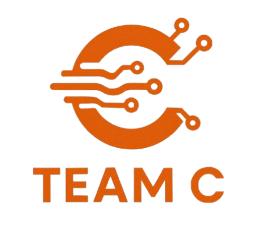

<!-- Improved compatibility of back to top link: See: https://github.com/othneildrew/Best-README-Template/pull/73 -->
<a id="readme-top"></a>
<!--
*** Thanks for checking out the Best-README-Template. If you have a suggestion
*** that would make this better, please fork the repo and create a pull request
*** or simply open an issue with the tag "enhancement".
*** Don't forget to give the project a star!
*** Thanks again! Now go create something AMAZING! :D
-->


<!-- PROJECT SHIELDS -->
<!--
*** I'm using markdown "reference style" links for readability.
*** Reference links are enclosed in brackets [ ] instead of parentheses ( ).
*** See the bottom of this document for the declaration of the reference variables
*** for contributors-url, forks-url, etc. This is an optional, concise syntax you may use.
*** https://www.markdownguide.org/basic-syntax/#reference-style-links
-->
[![Contributors][contributors-shield]][contributors-url]
[![Forks][forks-shield]][forks-url]
[![Stargazers][stars-shield]][stars-url]
[![Issues][issues-shield]][issues-url]
[![GPL-3.0][license-shield]][license-url]
[![LinkedIn][linkedin-shield]][linkedin-url]


<!-- PROJECT LOGO -->
<br />
<div align="center">
  <a href="https://github.com/applejuice7867/team-c-deaf-project">
    
  </a>

<h3 align="center">Deaf Transportation Aid</h3>

  <p align="center">
    project_description
    <br />
    <a href="https://github.com/applejuice7867/team-c-deaf-project"><strong>Explore the docs »</strong></a>
    <br />
    <br />
    <a href="https://github.com/applejuice7867/team-c-deaf-project">View Demo</a>
    &middot;
    <a href="https://github.com/applejuice7867/team-c-deaf-project/issues/new?labels=bug&template=bug-report---.md">Report Bug</a>
    &middot;
    <a href="https://github.com/applejuice7867/team-c-deaf-project/issues/new?labels=enhancement&template=feature-request---.md">Request Feature</a>
  </p>
</div>


<!-- TABLE OF CONTENTS -->
<details>
  <summary>Table of Contents</summary>
  <ol>
    <li>
      <a href="#about-the-project">About The Project</a>
      <ul>
        <li><a href="#built-with">Built With</a></li>
      </ul>
    </li>
    <li>
      <a href="#getting-started">Getting Started</a>
      <ul>
        <li><a href="#prerequisites">Prerequisites</a></li>
        <li><a href="#installation">Installation</a></li>
      </ul>
    </li>
    <li><a href="#usage">Usage</a></li>
    <li><a href="#roadmap">Roadmap</a></li>
    <li><a href="#contributing">Contributing</a></li>
    <li><a href="#license">License</a></li>
    <li><a href="#contact">Contact</a></li>
    <li><a href="#acknowledgments">Acknowledgments</a></li>
  </ol>
</details>


<!-- ABOUT THE PROJECT -->
## About The Project

[![Product Name Screen Shot][product-screenshot]](https://example.com)

The Deaf Transportation Aid by Team C Industries is a application to aid deaf people in navigating the public transportation systems in Hong Kong.

<p align="right">(<a href="#readme-top">back to top</a>)</p>


### Built With

* [![Node][Node.js]][Node-url]
* [![Pythonsomething][Python]][Python-url]

<p align="right">(<a href="#readme-top">back to top</a>)</p>


<!-- GETTING STARTED -->
## Getting Started

Here's how to get this working on your computer and start contributing.

### Prerequisites

Chrome is needed as we are currently using speech to text from chrome.  
* chrome(arch)
  ```sh
  yay -S google-chrome
  ```
* other distributions or operating systems  
  Follow the instructions of your operating system to install google chrome.  

### Installation

1. Clone the repo
   ```sh
   git clone https://github.com/applejuice7867/team-c-deaf-project.git
   ```
2. Host it

<p align="right">(<a href="#readme-top">back to top</a>)</p>


<!-- USAGE EXAMPLES -->
## Usage

As this project is still in early stages without any packages or hosting. Please clone the repo and host it yourself, it should be hosted in about 3 months(expect mobile app before 2026).

_For more examples, please refer to the [Documentation](https://example.com)_

<p align="right">(<a href="#readme-top">back to top</a>)</p>


<!-- ROADMAP -->
## Roadmap

- [ ] multi language support
- [ ] map features
- [ ] Better translation functions
    - [ ] text to speech
    - [ ] multi language support for tts and stt

See the [open issues](https://github.com/applejuice7867/team-c-deaf-project/issues) for a full list of proposed features (and known issues).

<p align="right">(<a href="#readme-top">back to top</a>)</p>


<!-- CONTRIBUTING -->
## Contributing

Contributions are what make the open source community such an amazing place to learn, inspire, and create. Any contributions you make are **greatly appreciated**.

If you have a suggestion that would make this better, please fork the repo and create a pull request. Currently we are focusing on getting the APIs working and intergrating more features, so help in those areas are greatly appreciated.

1. Fork the Project
2. Create your Feature Branch (`git checkout -b feature/AmazingFeature`)
3. Commit your Changes (`git commit -m 'Add some AmazingFeature'`)
4. Push to the Branch (`git push origin feature/AmazingFeature`)
5. Open a Pull Request

<p align="right">(<a href="#readme-top">back to top</a>)</p>

### Top contributors:

<a href="https://github.com/applejuice7867/team-c-deaf-project/graphs/contributors">
  
</a>


<!-- LICENSE -->
## License

Distributed under the GPL-3.0. See `LICENSE.txt` for more information.

<p align="right">(<a href="#readme-top">back to top</a>)</p>


<!-- CONTACT -->
## Contact

Apple juice - applejuiceprogame@gmail.com  
Marcus Ng - sp20246771@spcc.edu.hk  
Bily Wang - s20237044@elearn.hkbuas.edu.hk  

Project Link: [https://github.com/applejuice7867/team-c-deaf-project](https://github.com/applejuice7867/team-c-deaf-project)

<p align="right">(<a href="#readme-top">back to top</a>)</p>


<!-- ACKNOWLEDGMENTS -->
## Acknowledgments

* [Daniel She](https://github.com/shedaniel)
* [Thomas Yip]()
* [Tom Jong](https://github.com/JYWTom)

<p align="right">(<a href="#readme-top">back to top</a>)</p>


<!-- MARKDOWN LINKS & IMAGES -->
<!-- https://www.markdownguide.org/basic-syntax/#reference-style-links -->
[contributors-shield]: https://img.shields.io/github/contributors/applejuice7867/team-c-deaf-project.svg?style=for-the-badge
[contributors-url]: https://github.com/applejuice7867/team-c-deaf-project/graphs/contributors
[forks-shield]: https://img.shields.io/github/forks/applejuice7867/team-c-deaf-project.svg?style=for-the-badge
[forks-url]: https://github.com/applejuice7867/team-c-deaf-project/network/members
[stars-shield]: https://img.shields.io/github/stars/applejuice7867/team-c-deaf-project.svg?style=for-the-badge
[stars-url]: https://github.com/applejuice7867/team-c-deaf-project/stargazers
[issues-shield]: https://img.shields.io/github/issues/applejuice7867/team-c-deaf-project.svg?style=for-the-badge
[issues-url]: https://github.com/applejuice7867/team-c-deaf-project/issues
[license-shield]: https://img.shields.io/github/license/applejuice7867/team-c-deaf-project.svg?style=for-the-badge
[license-url]: https://github.com/applejuice7867/team-c-deaf-project/blob/master/LICENSE.txt
[linkedin-shield]: https://img.shields.io/badge/-LinkedIn-black.svg?style=for-the-badge&logo=linkedin&colorB=555
[linkedin-url]: https://linkedin.com/in/linkedin_username
[product-screenshot]: images/screenshot.png
[Node-url]: https://nodejs.org/en
[Node.js]: https://img.shields.io/badge/node.js-339933?style=for-the-badge&logo=Node.js&logoColor=white
[Python-url]: https://www.python.org/
[Python]: https://img.shields.io/badge/python-3670A0?style=for-the-badge&logo=python&logoColor=ffdd54